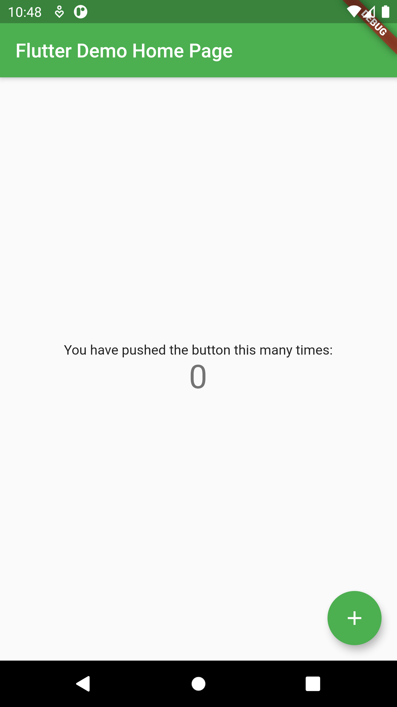

# App0: The Default App---FlutterCourse
 App0 : The Default App https://beflutter.pro/
 
 After installing flutter and setting up the editor, to test everything we need to run the default app.
 
 # Tutorial Video
 
https://www.youtube.com/watch?v=mmtuEKcvY3g
 
 # Screenshot
 
 
 
 
 # Links 
- How to make the first app : https://beflutter.pro/flutter/1/4
- Analysing the first app   : https://beflutter.pro/flutter/1/5
 
